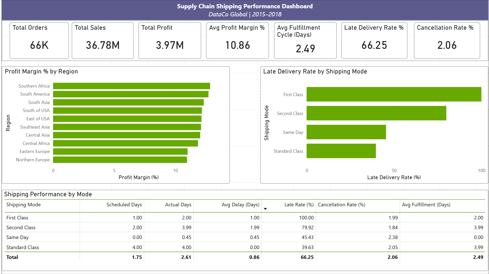
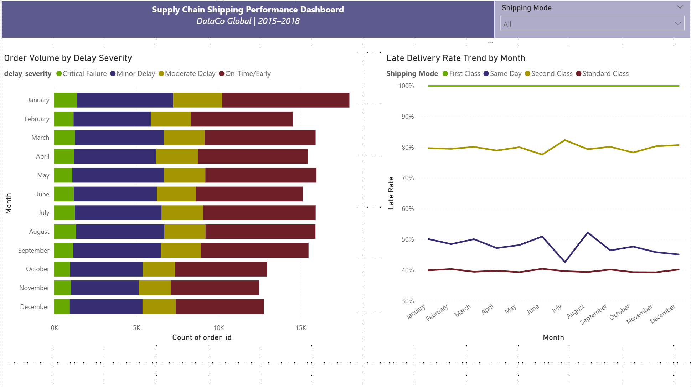
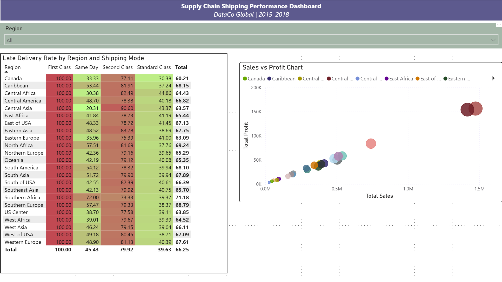

# Supply Chain Shipping Performance — Analytics Engineering

> **Stack:** PostgreSQL · dbt Core · Power BI  
> **Dataset:** DataCo Global | 2015–2018 | ~180K order line items across 22 regions

An end-to-end analytics engineering project that transforms raw transactional supply chain data into a structured data warehouse and executive dashboard. The goal was to move beyond surface-level reporting and identify the operational patterns driving late deliveries, margin variance, and fulfillment inconsistency.

---

## Dashboard





---

## Business Problem

DataCo Global operates across 22 regions with four shipping modes. With a 66% overall late delivery rate and limited visibility into where delays originate, the business lacked the data foundation to make targeted operational improvements. This project looks to answer three questions:

1. Which shipping modes and regions are driving late deliveries and by how much?
2. Is the late delivery problem operational, or is there a data or SLA definition issue?
3. Where are the most interesting areas to dig into for improving fulfillment performance and protecting margin?

---

## Key Findings & Business Recommendations

### 1. First Class has a 100% late delivery rate across the entire dataset
Every First Class order shows a scheduled window of 1 day but an actual delivery of 2 days, without a single exception across four years of data. That kind of consistency points less to an operations problem and more to a mismatch between what the SLA (Service Level Agreement — the contracted delivery window agreed with the carrier) promises and what is actually being delivered.

**Recommendation:** This pattern is worth flagging to the logistics or ops team. If the 1-day window has never been met, it raises the question of whether the SLA is correctly configured or whether customer-facing delivery promises need to be updated. Understanding whether this is a data entry issue or a real carrier problem would be a good first conversation to have.

---

### 2. Second Class late rates are high and look like a real operational problem
Unlike First Class, Second Class does not show the same rigid pattern. The late rate sits at around 80% with delays averaging nearly 2 days, which suggests actual inconsistency in fulfillment rather than a fixed SLA gap.

**Recommendation:** It would be worth breaking this down further by region or time period to see if the delays are concentrated somewhere specific or spread evenly. If there is a cluster, that gives the team something concrete to act on with the relevant carrier or warehouse.

---

### 3. Standard Class is the only mode consistently hitting its window
Standard Class averages 4 actual days against a 4 day schedule, making it the only mode that broadly delivers on its promise.

**Recommendation:** It is worth understanding what is different about how Standard Class orders are handled. Whether that is the carrier, the routing logic, or warehouse prioritisation, those factors could be relevant when reviewing how other modes are set up.

---

### 4. Profit margins look very uniform across regions and customer segments
Margin sits at around 11% across all 22 regions and all three customer segments with almost no variation. That level of consistency across very different markets is a little unusual and could be worth exploring.

**Recommendation:** This could simply reflect a centralised pricing policy, which is fine. But it is also worth asking whether the business is leaving margin on the table in higher-demand regions, or absorbing higher logistics costs in others without adjusting prices accordingly. A regional cost breakdown would help answer that question.

---

### 5. Cancellation and fraud rates are low overall but worth monitoring at the order level
The aggregate cancellation rate is around 2% and fraud is negligible, which looks healthy. However, aggregates can hide individual account patterns that would not be visible at this level.

**Recommendation:** If the business does not already have visibility into repeat cancellations or fraud flags at the customer level, that would be a useful addition. It is the kind of thing that is easy to monitor once the data is structured correctly, which it now is in `fct_orders`.

---

## Data Model

**Grain:** The raw source is at **order line item** grain — one row per product per order. `order_item_id` is the unique row key. `order_id` is not unique at the raw level and must be used with `COUNT(DISTINCT ...)` for order-level aggregations.

```
raw_supply_chain          (source — ~180K rows, order line item grain)
         |
         v
stg_supply_chain          (view — type casting, column renaming, grain documented)
         |
         v
int_shipping_performance  (view — delay logic, severity bucketing,
                           order health flags, fulfillment cycle time)
         |
         |---->  fct_orders            (table — row-level fact table for drill-through)
         |
         +---->  fct_shipping_summary  (table — aggregated by region x shipping mode
                                        for executive KPI dashboard)
```

---

## Project Structure

```
models/
├── staging/
│   ├── stg_supply_chain.sql          # Cleans and renames raw source columns
│   └── src_supply_chain.yml          # Source definition and raw table tests
├── intermediate/
│   └── int_shipping_performance.sql  # Shipping logic and business flags
└── marts/
    ├── fct_orders.sql                # Order-level fact table
    ├── fct_shipping_summary.sql      # Aggregated regional summary
    └── marts.yml                     # Mart model tests and documentation
data/
    DataCoSupplyChainDataset.csv      # Raw source data (DataCo Global, 2015-2018)
power_bi/
    supply_chain_dashboard.pbix       # Power BI dashboard file
docs/
└── screenshots/                      # Dashboard screenshots for README
```

---

## Metric Definitions

| Metric | Definition |
|---|---|
| `is_late_shipment` | 1 if `actual_shipping_days > scheduled_shipping_days` |
| `shipping_delay_days` | `actual_shipping_days - scheduled_shipping_days` |
| `delay_severity` | On-Time/Early · Minor (1 day) · Moderate (2 days) · Critical (3+ days) |
| `fulfillment_cycle_days` | Days between order placed and physically shipped |
| `order_health` | Complete · Canceled · Fraud · In Progress |
| `is_first_class_anomaly` | Flags First Class orders where actual days (2) exceed scheduled (1) — a systematic SLA mismatch across the entire dataset |
| `is_late_risk` | Source-provided predicted risk flag — can be compared against `is_late_shipment` to evaluate prediction accuracy |

---

## Tech Stack

| Tool | Purpose |
|---|---|
| PostgreSQL | Data warehouse |
| dbt Core | Transformation pipeline |
| dbt-utils 1.3.3 | Extended test macros |
| Power BI | Executive dashboard |

---

## Getting Started

**Prerequisites:** Python 3.8+, dbt-core, dbt-postgres, a running PostgreSQL instance.

```bash
# 1. Clone the repo
git clone https://github.com/aaryanm_0705/supply-chain-warehouse.git
cd supply-chain-warehouse

# 2. Configure your profile
cp profiles.yml.example ~/.dbt/profiles.yml
# Open ~/.dbt/profiles.yml and add your PostgreSQL credentials

# 3. Install dbt packages
dbt deps

# 4. Load the raw data
# Import the raw data into PostgreSQL as public.raw_supply_chain
# The CSV is available in the data/ folder of this repo, or can be downloaded
# from Kaggle (link in the Data Source section below)
# Load via DBeaver (Table Data Import) or psql \copy

# 5. Run the full pipeline
dbt run

# 6. Run all tests
dbt test
```

---

## Data Source

[DataCo Smart Supply Chain Dataset](https://www.kaggle.com/datasets/shashwatwork/dataco-smart-supply-chain-for-big-data-analysis) — Kaggle  
Covers 2015–2018 across 22 regions, 4 shipping modes, and 11 product departments.